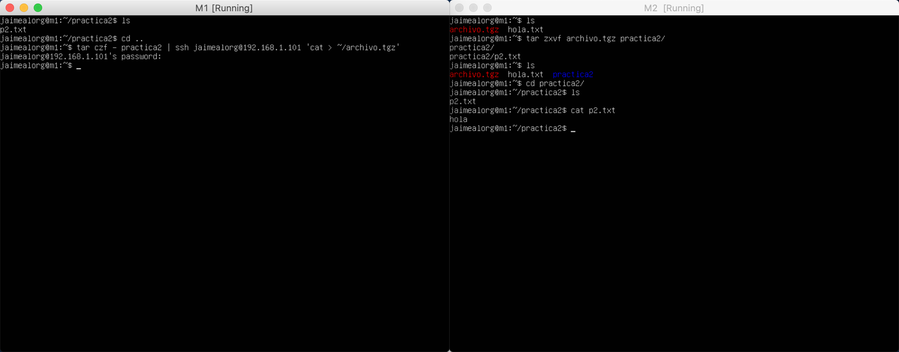
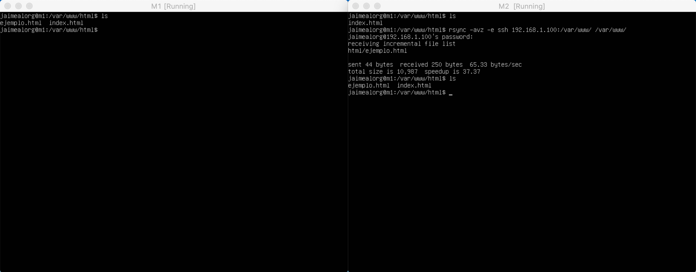
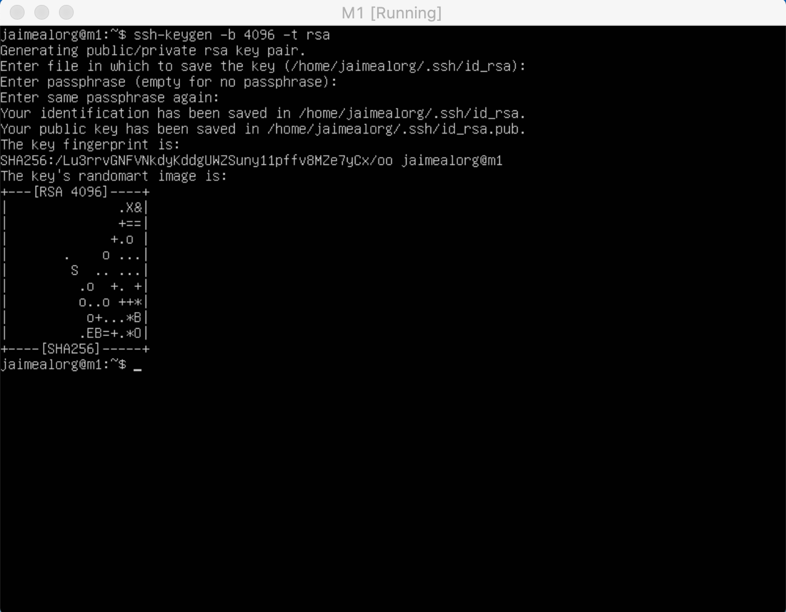
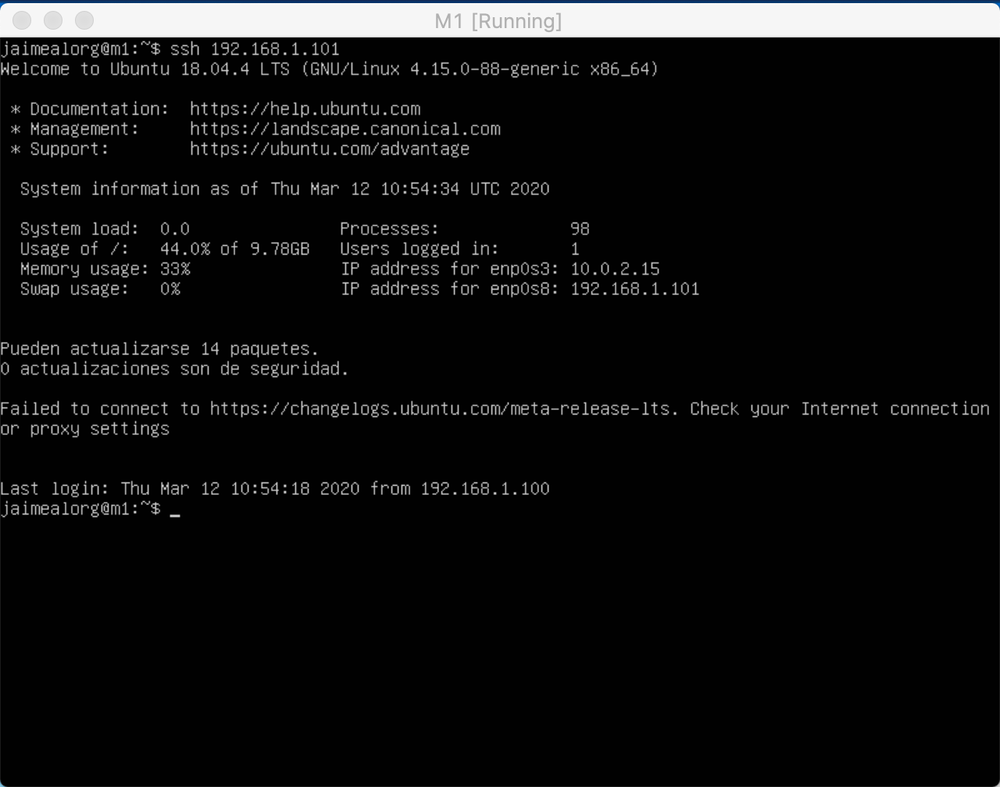
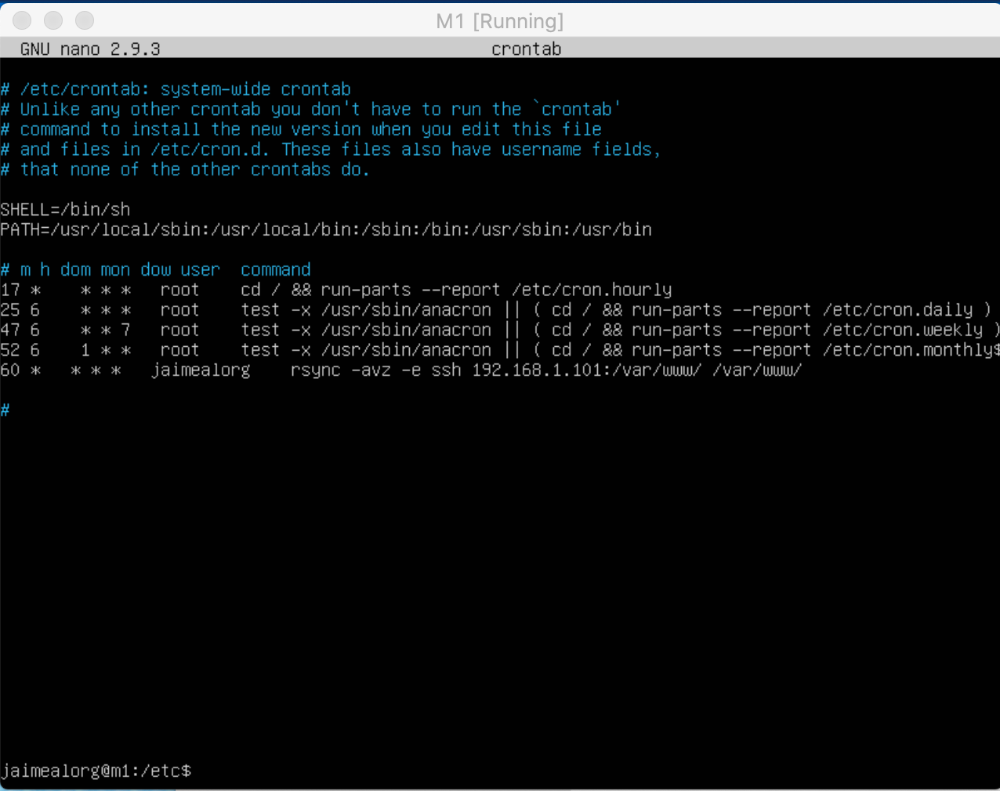

# Práctica 2

Jaime Álvarez Orgaz

## Tareas

Para la realización de esta práctica necesitaremos las dos máquinas que configuramos previamente en la práctica 1. En la práctica 2 realizaremos: 

1. Probar el funcionamiento de copia de archivos por ssh.
2. Clonar una carpeta entre dos máquinas.
3. Configurar ssh para acceder sin solicitar contraseña.
4. Establecer una tarea en cron que se ejecute cada hora para mantener actualizado el contenido del .directorio /var/www entre las dos máquinas.

## Copia de Archivos Mediante SSH (.tar)

Para clonar un archivo entre dos máquinas mediante ssh, primero vamos a crearnos una carpeta llamada **práctica 2** que va a contener un archivo **p2.txt**. Para clonarla vamos a **comprimir la carpeta en un .tgz y enviarla mediante ssh a m2**. Lo haremos mediante la siguiente línea: **tar czf - directorio | ssh usuario@equiporemoto 'cat > ~/archivo.tgz’**. Podemos ver en la siguiente foto que se ha copiado correctamete a la máquina 2 y que dentro de la carpeta práctica 2, esta nuestro archivo p2.txt

## Clonar Carpetas Mediante Rsync

Para clonar carpetas mediante Rsync primero vamos a instalarlo con la siguiente linea: **sudo apt-get install rsync**. Una vez instalado vamos a configurar nuestro usuario para poder realizar las configuraciones sobre un directorio sin ser root. Lo hacemos con **sudo chown usuario:usuario –R /var/www** 

Una vez hechos todos estos pasos vamos a clonar la carpeta var/www/ de m1 a m2. Para ello ejecutamos la siguiente linea: **rsync -avz -e ssh ipmaquina1:/var/www/ /var/www/**. En la imagen podemos ver que se ha clonado correctamente ya que ejemplo.html solo lo teniamos antes en M1.

## Configurar SSH para Acceder sin Solicitar Contraseña

Vamos a ejercutar en M1 el siguiente comando para generar la clave de ssh **ssh-keygen -b 4096 -t rsa**. 

Una vez que tengamos la clave creada vamos a darle permisos al archivo authorized_keys del equipo remoto mediante **chmod 600 ~/.ssh/authorized_keys**.
Una vez hecho estos pasos vamos a copiar la clave a M2 con **ssh-copy-id 192.168.1.101**. En la siguiente foto se puede ver como ya no nos pide la clave cuando hacemos **ssh 192.168.1.191**.

## Establecer una Tarea en Cron
Vamos a establecer una tarea en cron que se ejecute cada hora para mantener actualizados el contenido del directorio /var/www/. Para ello hay que modificar el archivo **etc/crontab/**. En la siguiente foto se ve que línea tenemos que añadirle al archivo para que pueda ejercutar bien la tarea.

