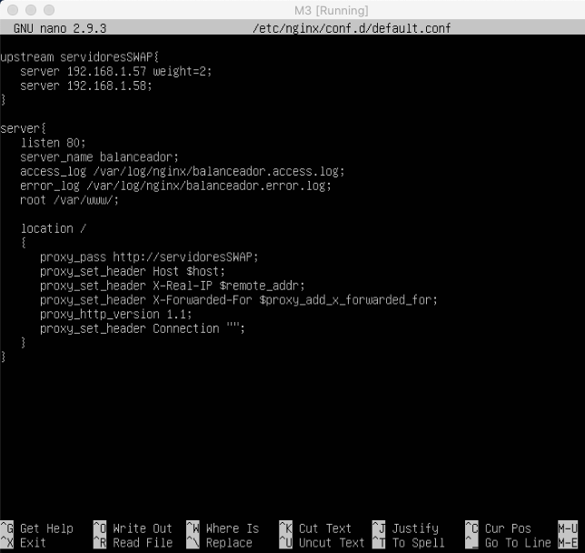
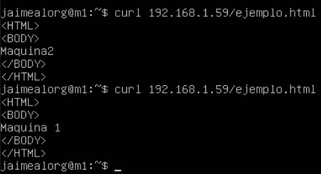
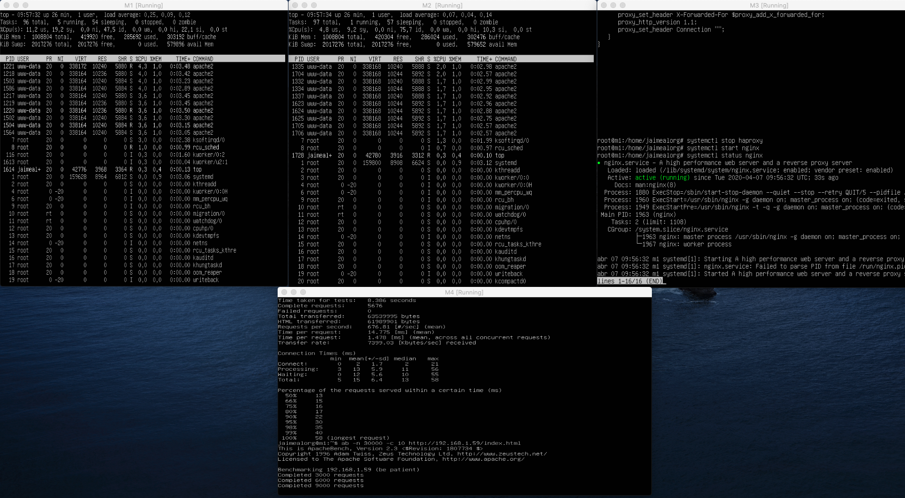
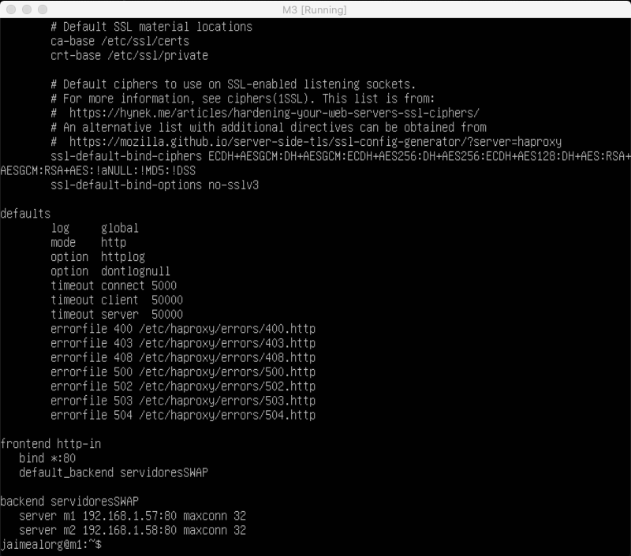
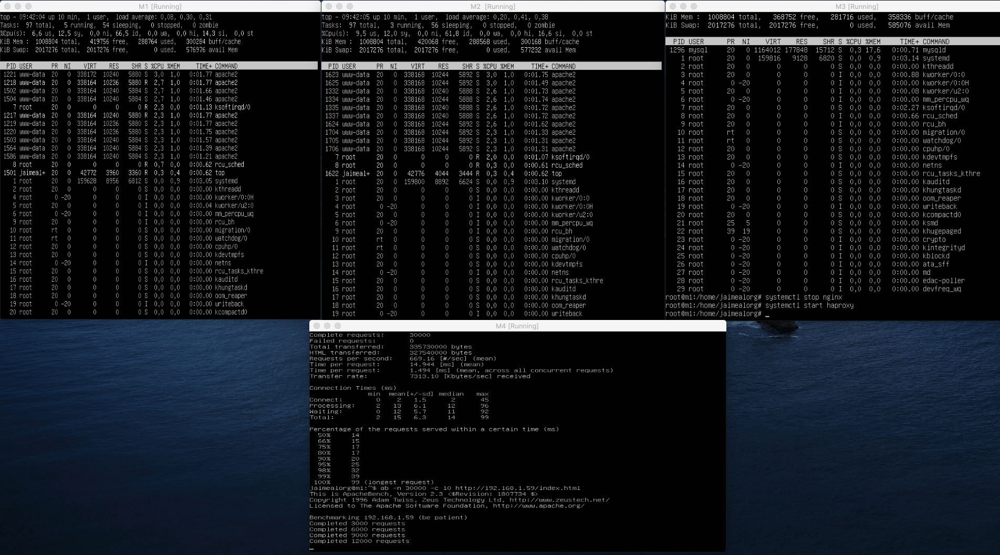

# Práctica 3

Jaime Álvarez Orgaz

## Tareas

1. Configurar una máquina e instalar el nginx como balanceador de carga
2. Configurar una máquina e instalar el haproxy como balanceador de carga
3. Someter a la granja web a una alta carga, generada con la herramienta Apache Benchmark, teniendo primero nginx y después haproxy.

## Configuración de Nginx y Benchmark

Para instalar nginx simplemente escribimos el la línea de comandos **sudo apt-get install nginx**. Una vez lo tengamos instalado vamos a modificar el archivo **/etc/nginx/nginx.conf** y vamos a comentar la linea **#include /etc/nginx/sites-enabled/*;** Una vez hecho eso vamos a crear el archivo **/etc/nginx/conf.d/default.conf**. Este archivo contendrá lo siguiente:

Una vez tengamos hecha la configuración, podemos hacer **curl** en M4 a M3 que es el balanceador. Si lo hacemos dos veces, podemos ver como nos muestra el ejemplo.html de la máquina 1 y de la máquina 2. La ip de la máquina que tiene el balanceador es **192.168.1.59**. En la siguiente foto se muestra que esta funcionando correctamente.

Para acabar este apartado voy a mostrar mediante apache benchmark el funcionamiento del balanceador. Para ello encendemos el servicio de nginx **sudo servicectl start ngynx** en M3 y escribimos el siguiente comando en M4: **ab -n 30000 -c 10 http://192.168.1.59/index.html**. En M1 y M2 se muestra mediante top las tareas y en M3, el funcionamiento del servidor nginx.

## Configuración de Haproxy y Benchmark
Para instalar escribimos en la línea de comandos **sudo apt-get install haproxy**. Una vez instalado, modificamos el archivo **/etc/haproxy/haproxy.conf** añadiendo los apartados frontend y backend que podemos ver en la siguiente foto:

No podemos tener en uso el puerto 80 con dos servicios. Para ello, paramos nginx mediante **sudo servicectl stop nginx** e inciamos haproxy. A continuación podemos ver el correcto funcionamiento haciendole el benchmark. Como en nginx, M1 y M2 muestran las tareas mediante top, en M3 inicio el servicio haproxy y en M4, ejecuto el benchmark mediante la orden **ab -n 30000 -c 10 http://192.168.1.59/index.html**.

