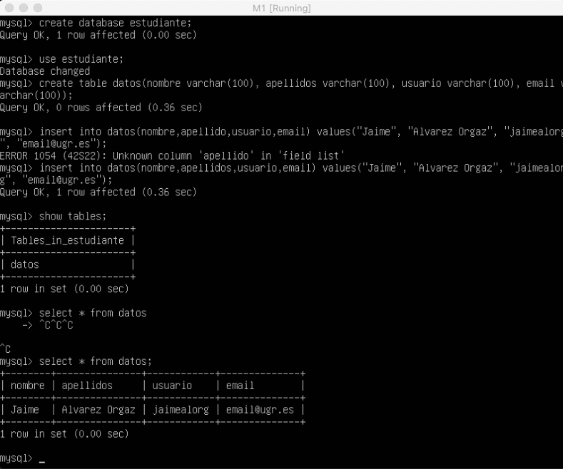
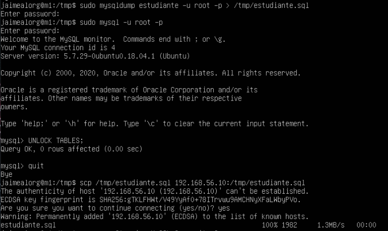
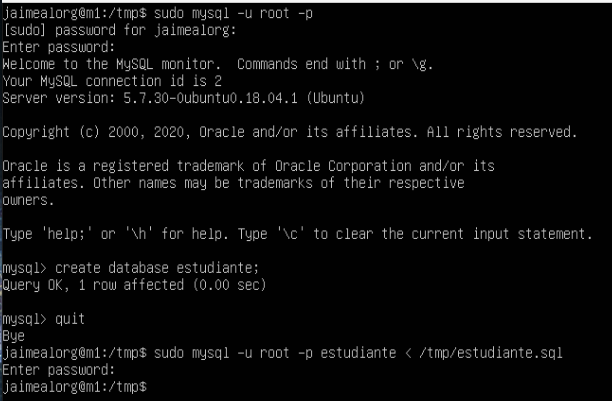
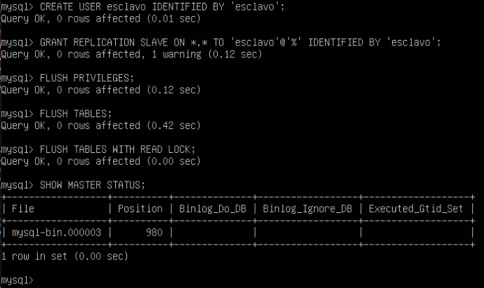
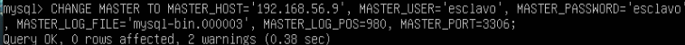
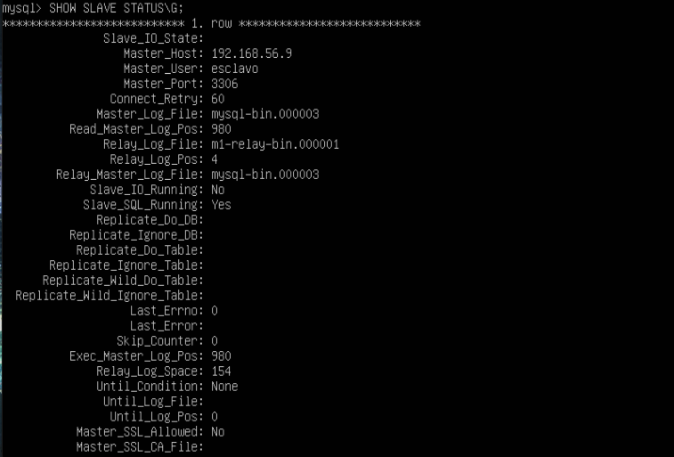

# Práctica 5 SWAP

Jaime Álvarez Orgaz

## Tareas

1. Crear una BD con al menos una tabla y algunos datos.
2. Realizar la copia de seguridad de la BD completa usando mysqldump en la máquina principal y copiar el archivo de copia de seguridad a la máquina secundaria.
3. Restaurar dicha copia de seguridad en la segunda máquina (clonado manual de la BD), de forma que en ambas máquinas esté esa BD de forma idéntica.
4. Realizar la configuración maestro-esclavo de los servidores MySQL para que la replicación de datos se realice automáticamente.

## Creación de una BD con una Tabla y Algunos Datos

Para empezar con este ejercicio vamos a conectarnos al servidor mysql en la máquina M1 con el comando **sudo mysql -u root -p**. Apartir de aqui, vamos a crear una base de datos e insertar datos en ella con los siguientes comandos:

1. create database estudiante;
2. use estudiante;
3. create table datos(nombre varchar(100), apellidos varchar(100), usuario varchar(100), email varchar(100));
4. insert into datos(nombre,apellidos,usuario,email) values ("Jaime", "Álvarez", "jaimealorg", email@ugr.es");
5. show tables.
6. select * from datos;

## Replicar una BD MySQL con Mysqldump

Mysqldump es una herramienta que ofrece MySQL para clonar la BD que tenemos en nuestra máquina. Solo puede ser usado para generar copias de seguridad de la BD. Antes de hacer la copia de seguridad tenemos que seguir los siguientes pasos para que no se pueda acceder a la BD para cambiar nada.

1. sudo mysql -u root -p
2. FLUSH TABLES WITH READ LOCK;
3. quit

Una vez hecho lo anterior, ya podemos hacer mysqldump y guardar los datos en el servidor principal M1. Consecutivamente desbloqueamos las tablas y procedemos a copiar el archivo .sql que acabamos de generar en M1 a la máquina M2.

Una vez tengamos el archivo copiado en M2, ya podemos importar la BD completa en MySQL en M2, con los siguientes pasos:  

## Replicar BD. Maesto-Esclavo

MySQL tiene la opción de configurar el demonio para hacer la réplica de las BD sobre un esclavo a partir de los datos que almacena el maestro. Este proceso automático resulta muy conveniente en un entorno de producción real. 

Lo primero que voy a hacer es configurar la máquina del maestro(M1):

1. Modificar el archivo con sudo nano /etc/mysql/mysql.conf.d/mysqld.cnf
2. Comentar la línea #bind-address 127.0.0.1
3. Escribir log_error = /var/log/mysql/error.log
4. Descomentar server-id = 1
5. Descomentar log_bin = /var/log/mysql/bin.log
6. Reiniciar el servicio con /etc/init.d/mysql restart

Una vez configurado el maesto voy a configurar el esclavo en M2. Haremos la misma configuración que en M1 salvo la línea server-id que en este caso será = 2. Una vez hecho esto, reiniciamos el servicio como hicimos en M1. Ya tendriamos configurado el esclavo. Para el siguiente paso vamos a ir de vuelta a M1 para crear un usuario y darle permisos de acceso para la replicación.

Consecutivamente voy a hacer la configuración del esclavo en M2 con el siguiente comando dentro de MySQL:

Una vez que tengamos hechas ambas configuraciones, iniciamos en M2 el escalvo con **START SLAVE** y en M1 volvemos a activar las tablas con **UNLOCK TABLES**. Para ver que todo se ha configurado correctamente ejecutamos en M2 **SHOW SLAVE STATUS\G**

