# Práctica 6

Jaime Álvarez Orgaz

## Tareas

1. Configurar una máquina como servidor de disco NFS y exportar una carpeta a los clientes.
2. Montar en las máquinas cliente la carpeta exportada por el servidor.
3. Comprobar que todas las máquinas pueden acceder a los archivos almacenados en la carpeta compartida.
4. Hacer permanente la configuración en los clientes para que monten automáticamente la carpeta compartida al arrancar el sistema.

## Configurar una máquina como servidor de disco NFS

Para comenzar esta práctica, voy a clonar M1 y cambiarle la ip de la interfaz host-only a **192.168.56.13**. Una vez tenga la máquina funcionando, instalo NFS con el siguiente comando: **sudo apt-get install nfs-kernel-server nfs-common rpcbind**. A continuación creamos la carpeta que vamos a compartir con los clientes y cambiamos el propietario y permisos de esa carpeta con los siguientes comandos:

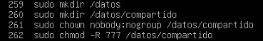

Para acabar la configuración de NFS tenemos que dar permiso de acceso a las máquinas M1 y M2, modificando el archivo **/etc/exports** con las siguiente línea:

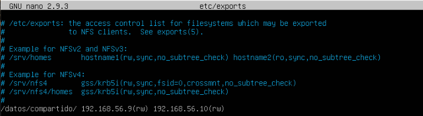

Finalmente reiniciamos el servicio y comprobamos que esta todo correcto con:
1. sudo service nfs-kernel-server restart
2. sudo service nfs-kernel-server status

## Configuración de clientes M1 y M2

Tanto en M1 como en M2 debemos de seguir los siguientes pasos, instalar los paquetes necesarios y crear el punto de montaje. Primero vamos a instalar el paquete **nfs-common rpcbind**, después vamos a crear el directorio datos y para terminar vamos a montar la carpeta remota sobre el directorio recién creado. Podemos ver que funciona correctamente con el comando **ls -la datos**. Este proceso nos permitirá leer y escribir archivos que haya almacenados en la carpeta compartida. Los comandos para hacer esto posible son los siguientes: 

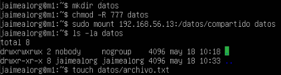

Podemos ver el correcto funcionamiento creando un archivo en la carpeta compartida en M1 y comprobando si esta en la carpeta datos en M2. La siguiente captura es de la máquina M2 y se puede ver que el archivo **archivo.txt** que creamos en la captura anterior, esta disponible en la carpeta compartida. 

Para hacer la configuración permanente y que cada vez que reiniciemos la máquina, la carpeta se monte automáticamente debemos de añadir la siguiente línea al archivo **/etc/fstab**. **IP_NFS:/datos/compartido /home/usuario/datos/ nfs auto,noatime,nolock,bg,nfsvers=3,intr,tcp,actimeo=1800 0 0**. En la captura que voy a mostar, la línea se ve cortada pero esta escrita correctamente. Este mismo proceso lo haríamos también en M2. 

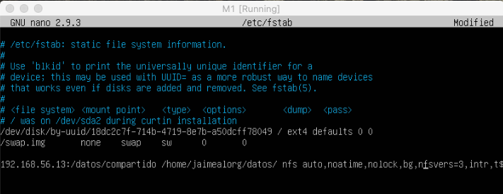

## Seguridad en el Servidor NFS

En este apartado partimos de configurar IPTABLES con política por defecto de denegación implícita de tráfico entrante con los siguietes comandos:

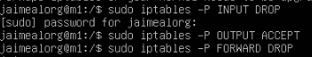

Abrimos los puertos asociados al servicio NFS. En **mountd** modificamos el archivo **/etc/default/nfs-kernel-server** y cambiamos **RCPMOUNTDOPTS** a lo siguiente:

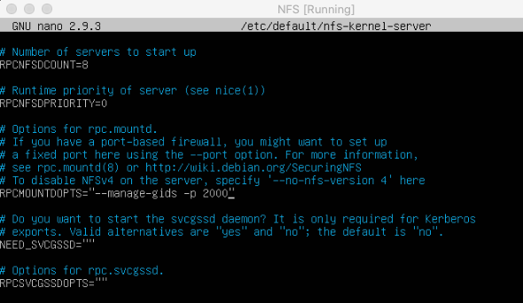

En **nlockmgr** creamos el archivo **swap-nfs-ports.conf** en **/etc/sysctl.d** y añadimos las siguientes dos líneas. Una vez que las escribamos, guardamos y ejecutamos sistema con el archivo de configuración **swap-nfs-ports.conf**. Esto lo realizamos mediante **sudo sysctl --system** y **/etc/init.d/nfs-kernel-server restart**.

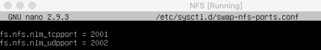

Comprobamos los puertos asociados a cada servicio con **rpcinfo -p**

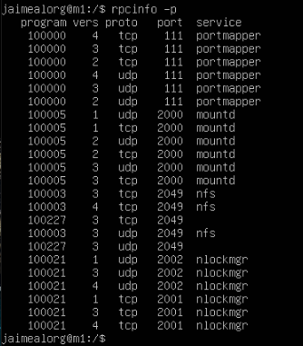

Abrimos los puertos correspondientes en la máquina NFS para que las máquinas M1 y M2 puedan acceder a NFS:

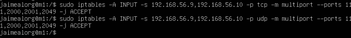

Para comprobar el correcto funcionamiento de la configuración de la seguridad realizada, creamos un archivo **prueba.txt** en M1 y podemos observar en M2 que esta en la carpeta compartida.

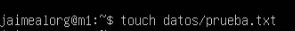
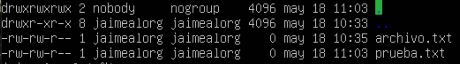